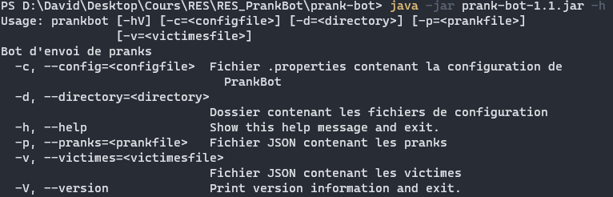

# RES_PrankBot

[](https://github.com/david-pellissier/RES_PrankBot/releases/latest)
[](https://github.com/david-pellissier/RES_PrankBot/issues)
[](#)
[](https://github.com/david-pellissier/RES_PrankBot/releases/latest)

## Description du projet

PrankBot est un outil développé en Java qui pour but d'envoyer des mails forgés (pranks) à des groupes de victimes.

Les groupes sont composés d'un expéditeur et de plusieurs destinataires.
À l'exécution, le bot envoie à chaque destinataire du groupe un mail forgé de la part de l'expéditeur avec pour contenu un prank aléatoire tiré de la liste de pranks.

Le projet est issu du labo SMTP du cours HEIG-VD RES de 2021 ([lien](https://github.com/SoftEng-HEIGVD/Teaching-HEIGVD-RES-2021-Labo-SMTP)).

## Diagramme de classes


C'est la classe *PrankBot* qui manipule les autres classes selon les fichiers de config qui lui sont passés en arguments.

1. Lire la configuration à l'aide de ConfigManager
2. Créer la connexion à l'aide SMTPClient
3. Initialiser le PrankGenerator
4. Envoyer les pranks avec SMTPClient

Nous utilisons [Picocli](https://picocli.info/) pour gérer l'interface en ligne de commandes.

## Configuration

Pour fonctionner, PrankBot a besoin de 3 fichiers de configurations.

Vous trouverez des exemples [ici](https://github.com/david-pellissier/RES_PrankBot/exemples).

### Config générale

Le fichier *config.properties* contient les informations suivantes:

- *smtpServerAddress*: Adresse du serveur SMTP auquel envoyer les mails
- *smtpServerPort*: Port du serveur SMTP
- *numberOfGroups*: Nombre de groupes de victimes à créer. Le bot doit pouvoir générer des groupes de 3 personnes au minimum

Il est possible de spécifier un fichier avec l'option `-c <filename>`

### Victimes

Le fichier *victimes.json* contient la liste des victimes (mail + nom d'affichage) en format JSON

Il est possible de spécifier un fichier avec l'option `-v <filename>`

### Pranks

La liste des pranks *pranks.json* doit contenir au moins 1 prank. Les pranks envoyés seront aléatoires s'il y en a plusieurs dans la liste.

Il est possible de spécifier un fichier avec l'option `-p <filename>`

#### Utilisation de variables

Afin de personnaliser les messages en fonction des émetteurs/destinataires, il est possible d'utiliser des variables dans les pranks.

Voici la liste de ces variables:

|variable|valeur|
|--|--|
|%e_mail%|adresse email de l'expéditeur|
|%e_name%|nom d'affichage de l'expéditeur|
|%d_mail%|adresse email du destinataire|
|%d_name%|nom d'affichage du destinataire|

## Utilisation

Après avoir configuré les fichiers, il suffit d'exécuter le .jar de PrankBot avec les bonnes options de fichiers:



## Mettre en place le serveur SMTP de test

Une image Docker est à votre disposition pour mettre en place un serveur SMTP de test. Elle utilise [MockMock](https://github.com/tweakers/MockMock/) avec les ports par défaut.

Instructions pour la déployer:

1. Build l'image avec le dockerfile situé dans *mock_server*

```sh
 docker build -t mock_smtp mock_server/
```

2. Exécuter l'image

```sh
docker run -p 80:8282 -p 25:25 --rm mock_smtp
```

Le serveur MockMock devrait alors être accessible depuis l'hôte sur les ports 80 (HTTP) et 25 (SMTP).
